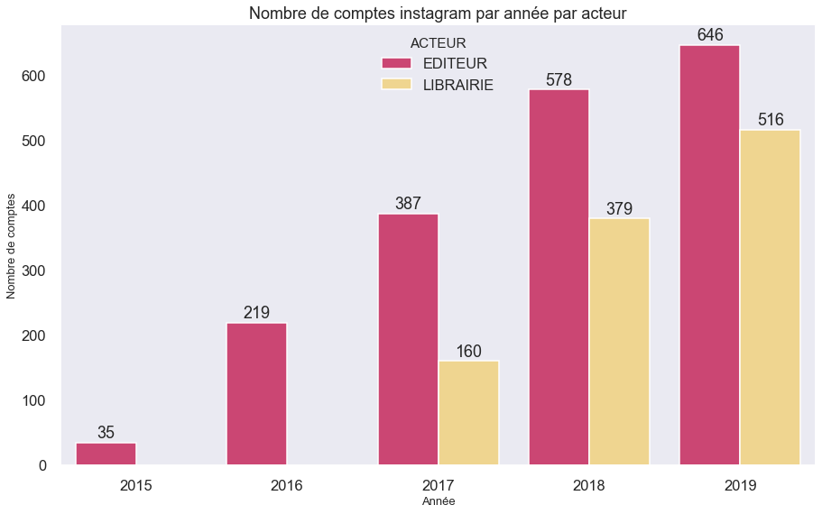
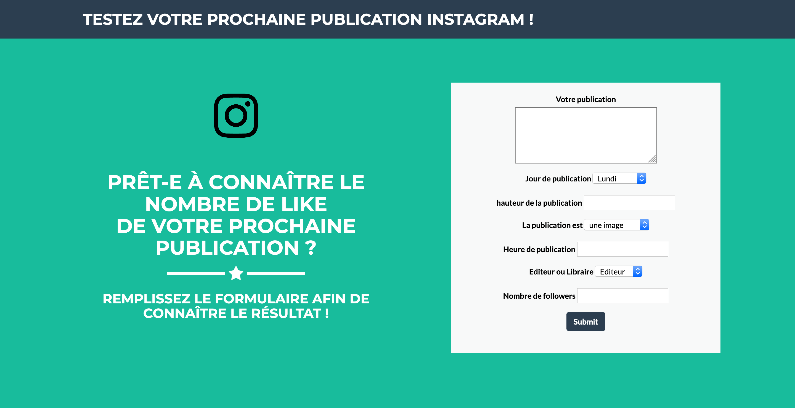

# [Instagram : Prédiction des likes pour des comptes d'éditeurs et de libraires]

**[Sandrine Henry]**

**[IronHack Paris Juin 2019]**

## Overview

Sélection et apprentissage supervisé d'un modèle prédiction - XGBOOST - afin de déterminer le nombre de likes des publications sur Instagram. Et plus particulièrement pour deux acteurs du secteur du livre : les éditeurs et libraires. 

* Technologies and tools :
	* Python
	* Statistical analysis
	* Data visualization
	* Jupyter Notebook
	* Tableau
	* Machine Learning
	* Natual Language Processing
    

## Data Preparation

### Dataset

Partie d'une base de données construite précédement, j'ai conservé les comptes instagram des éditeurs et libtraires.  

A l'aide des librairies `SELENIUM` pour automatiser le chargement des pages et `BEAUTIFULSOUP`, j'ai ensuite scrappé les données désirées - les 12 publications des comptes sur instagram - pendant un mois, du 15 oct. au 15 nov.

<a href="https://github.com/sandrineh/data-labs/blob/master/final-project/my-code/PROJET_FINAL_ETAPE_WEBSCRAPING.ipynb">Webscraping</a> et <a href="https://github.com/sandrineh/data-labs/blob/master/final-project/my-code/PROJET_FINAL_ETAPE_WEBSCRAPING_SUITE.ipynb">Webscraping suite</a>

### Data Wrangling and Cleaning

Pour enrichir le dataset, je me suis ensuite référée aux lectures relatives aux bonnes pratiques sur instagram qui mettent en avant les notions de jour, d’heure de publication, de longueur de texte, du bon usage des hashtags...j’ai créé les colonnes en conséquence.  
J’ai par la suite supprimé les colonnes relatives à la localisation trop peu renseignées et enfin j’ai supprimé les doublons.
 
Au final je me suis retrouvée avec un dataset de 23K publications (lignes) et 29 colonnes.

### Data Storage

**Dataset** : <a href="https://github.com/sandrineh/data-labs/tree/master/final-project/my-code/data">projet_ironhack_insta_final.csv</a>

## Data Analysis

### Overview

Overview the general steps you will go through to analyze your data in order to test your hypothesis.

### Data Exploration and Visualization

1. Data Exploraion et Analyse <a href="https://github.com/sandrineh/data-labs/blob/master/final-project/my-code/PROJET_FINAL_ETAPE_MACHINE_LEARNING.ipynb">Etapes 1 à 4</a> 

2. Datavisualisation : <a href="https://public.tableau.com/profile/sandrine.henry#!/vizhome/Ironhack_Instragram_project/Unmoisdepublications?publish=yes">Tableau Public</a>

### Model Training and Evaluation

<a href="https://github.com/sandrineh/data-labs/blob/master/final-project/my-code/PROJET_FINAL_ETAPE_MACHINE_LEARNING.ipynb">Etapes 4 à 12</a>

## Conclusion
1. Présentation du projet : <a href="https://sandrineh.github.io/docs/Projet_Ironhack_Final_Janvier_2020.pdf">Here</a>
2. Tester l'outil de prédiction : <a href="https://eleonoreh.pythonanywhere.com/">Here</a> 
